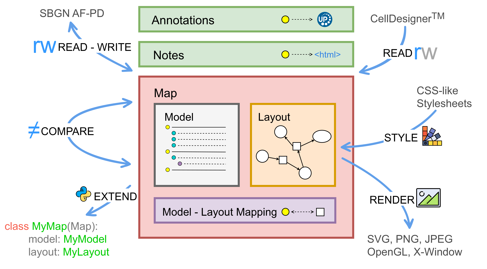

# <span style="font-weight:bold;color:rgb(22 66 81)">moma</span><span style="font-weight:bold;color:rgb(242 200 100)">py</span>

<span style="font-weight:bold;color:rgb(22 66 81)">moma</span><span style="font-weight:bold;color:rgb(242 200 100)">py</span> is a library for working with molecular maps.
It currently supports [SBGN](https://www.sbgn.org) and [CellDesigner](https://www.celldesigner.org/) maps.
Its key feature is its definition of a map, that is formed of two entities: a model, that describes what concepts are represented, and a layout, that describes how these concepts are represented.
This definition is borrowed from [SBML](https://www.sbml.org) and its extensions layout+render, that allow users to add a layout to an SBML model.
<span style="font-weight:bold;color:rgb(22 66 81)">moma</span><span style="font-weight:bold;color:rgb(242 200 100)">py</span> aims at extending this definition to SBGN and CellDesigner maps.

Features of <span style="font-weight:bold;color:rgb(22 66 81)">moma</span><span style="font-weight:bold;color:rgb(242 200 100)">py</span>:



## Installation

<span style="font-weight:bold;color:rgb(22 66 81)">moma</span><span style="font-weight:bold;color:rgb(242 200 100)">py</span> is available as a Python package and can be installed with pip as follows:

`pip install momapy`

## Usage

Typical usage of <span style="font-weight:bold;color:rgb(22 66 81)">moma</span><span style="font-weight:bold;color:rgb(242 200 100)">py</span> includes reading a map and exploring its model:

```python
import momapy.sbgn.io.sbgnml
from momapy.io import read

map_ = read("my_map.sbgn").obj
for process in map_.model.processes:
    print(process)
```

Or rendering its layout:

```python
import momapy.rendering.skia
from momapy.rendering.core import render_map

render_map(map_, "my_file.pdf", format="pdf", renderer="skia")
```

## User manual

A user manual showcasing the main feature of <span style="font-weight:bold;color:rgb(22 66 81)">moma</span><span style="font-weight:bold;color:rgb(242 200 100)">py</span> is available here: [User manual](demo.ipynb).

## Documentation

A complete documentaton for <span style="font-weight:bold;color:rgb(22 66 81)">moma</span><span style="font-weight:bold;color:rgb(242 200 100)">py</span> is available here: [API reference](api_reference/momapy.md).
